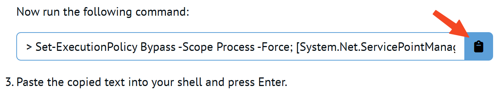
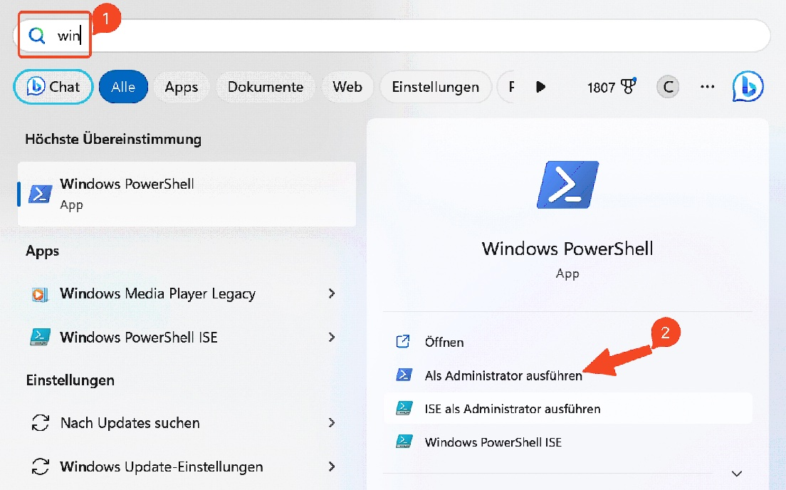
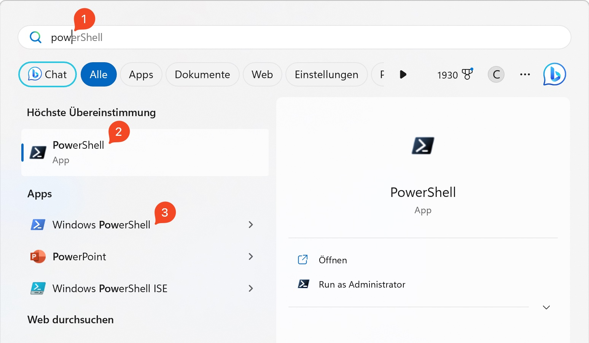

# 👉 Installationsvorbereitungen

Installation von "Chocolatey".

1. Suche "Chocolatey install" in Google
2. Zirka zur Mitte scrollen und den Quellcode in die Zwischenablage kopieren

1. Windows-Taste drücken "Win" eingeben und die Windows-PowerShell als Administrator öffnen

1. den kopierten Code nun einfügen und ausführen (Enter)
2. `choco --version` ausführen. Es sollte **1.3.0** oder höher ausgegeben werden.

# 👉 Installation von PowerShell Core

1. `choco find powershell-core` ausführen. Hier sollte die PowerShell 7.x.x ausgegeben werden.
2. `choco install powershell-core -y` ausführen, dies installiert die PowerShell Core.
3. Anschließend sollte die PowerShell Core im Startmenü vorhanden sein. Hier einfach nach "pow" (1) suchen

Das Dunkle Symbol (2) ist die PowerShell Core, das Blaue (3) die bereits vorhandene Windows PowerShell.

Ggfs. wird die PowerShell Core nur mit "PowerShell 7" oder "pwsh" als Suchbegriff gefunden!

# Folgende Anwendungen empfehle ich mit Choco zu installieren:

| Programm | Version    | Name in Choco | Beschreibung |
|----------|------------|---------------|--------------|
| Greenshot|1.2.10.6+   | `greenshot`   | Sehr nützliches Tool zum erstellen von Screenshots |
| Git      | 2.40.0+    | `git`         | Versionskontrolle |
| Visual Studio Code | 1.77.3+ | `vscode` | Editor / Entwicklungsumgebung für alle möglichen Sprachen |
| VIM      | 9.0.1469+  | `vim`         | Konsolen-Texteditor (sehr zu empfehle) oder alternativ NeoVIM s.u. |
| NeoVIM   | 0.8.3+     | `neovim`      | Konsolen-Texteditor, wie VIM mit kleinen Unterschieden |
| Github Client | 2.27.0+ | `gh`        | Github Client, ermöglicht das Anlegen von Repositories und vieles mehr direkt aus der Konsole heraus |
| IrfanView | 4.62+     | `irfanview`   | Bildbetrachtungsprogramm (deutsche Sprache enthalten) - Sehr nützlich |
| Google Chrome | 112.0.5615.138+ | `googlechrome` | Web-Browser (sollte jeder kennen) |
| VLC      | 3.0.18+    | `vlc`         | Video Player der viele Formate beherscht |

All diese Programme lassen sich mit einer einzigen Befehlszeile in der PowerShell (achtung: als Administrator öffnen!) installieren:

`choco install "greenshot;git;vscode;neovim;gh;irfanview;googlechome;vlc" -y`

Ein paar Minuten später ist alles installiert. Kein Zutun notwendig, es geht ALLES automatisch!

Um alle mit choco installierten Programe upzudaten kann einfach `choco upgrade all -y` ausgeführt werden. Auch hier geht alles automatisch.

# Zurück zu...

- [Übersicht dieses Tutorials](../../readme.md)
- [Alle Themenbereichen](https://github.com/bugfrei/itea.git)
